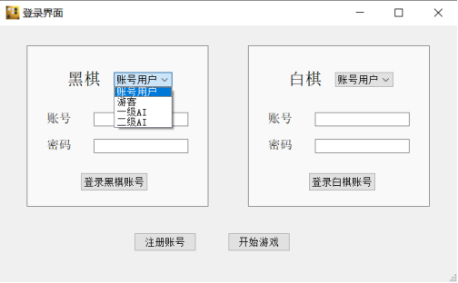
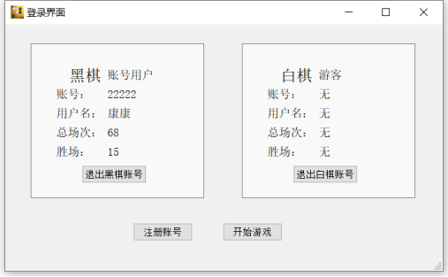
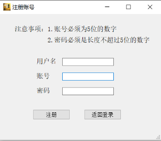
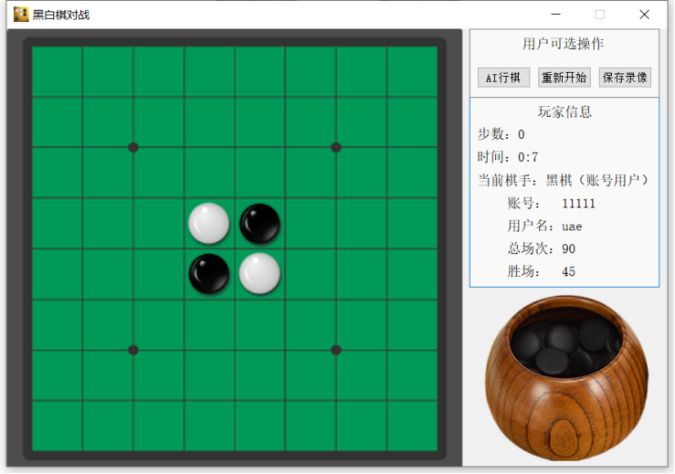
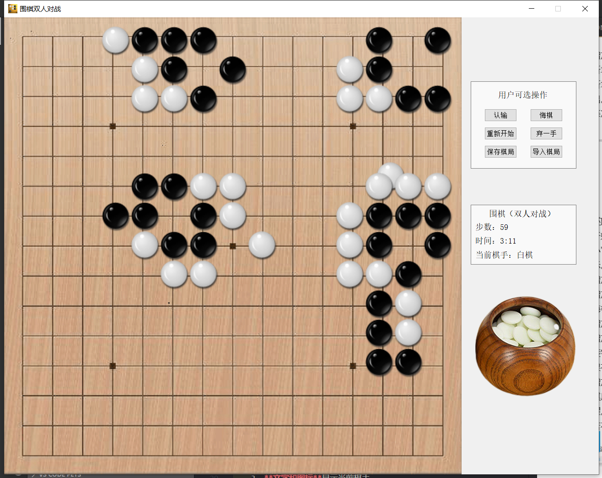
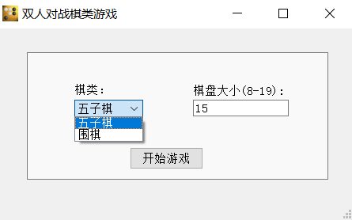
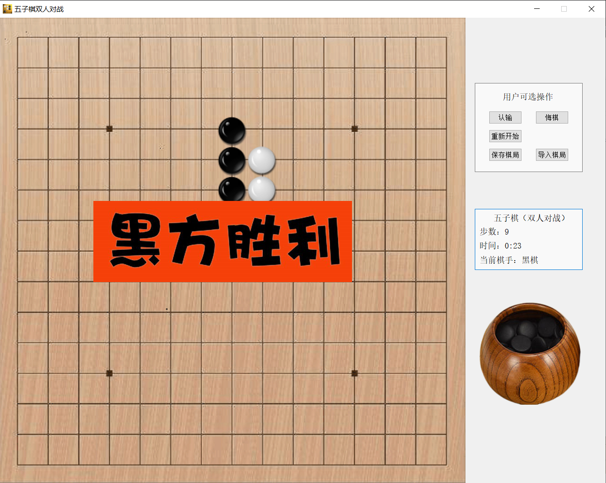
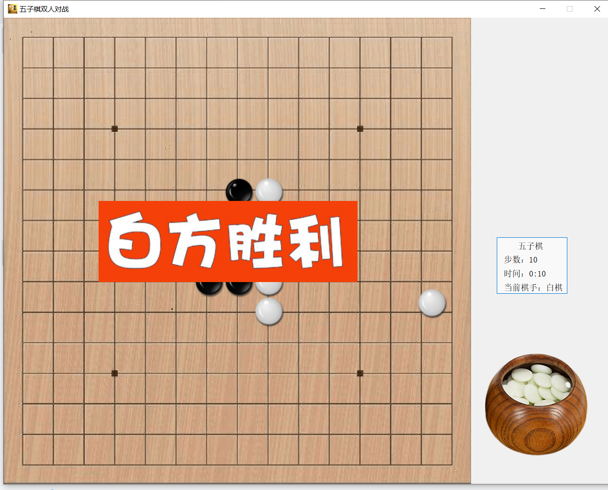

### v4
* 在V3的基础上增加了黑白棋对战界面。此外，还新增了如下主要功能：
  1. 增加**账号管理功能**。用户可以注册、登录账号，用户数据保存在本地的`usr_data`文件夹当中，一个用户一个文件夹。在登录界面和黑白棋对战界面中显示账号用户的相关信息。若不使用账号登录，用户也可以选择游客、一级AI和二级AI。
  2. 增加**黑白棋AI落子功能**。玩家可以选择一级AI和二级AI，二级AI可以稳定战胜一级AI。
  2. 增加**黑白棋录像与回放功能**。玩家在对局开始之前可以点击“保存录像”记录一整局的对战过程，录像保存在本地的`usr_data/records`文件夹当中。

 
 
 
 

---

### v3
* 在V2的基础上增加了围棋对战界面。围棋窗口与五子棋窗口不同之处有：
    1. 增加了**弃一手**按钮。用户可以放弃落子一回合。
    2. 新增了“禁止**打劫**”的窗口提醒。
    3. 新增了“当前位置无气”的窗口提醒，当棋手在**禁着点**落子时会跳出。
    4. 每次棋手落子时。会自动**清除场上所有的无气棋子**。
 

---

### v2
* 在V1的基础上增加了开始界面，并且添加了一些小功能：
    1. 开始界面可以选择围棋或五子棋，以及输入棋盘尺寸。“棋盘大小”栏只允许输入数字，尺寸为空或输入超过范围会跳出窗口提示。
    2. 增加了**认输**按钮。棋局结束后无法导入认输。
    3. 增加了**悔棋**按钮。棋手仅能悔棋一次，且棋局刚开始或结束无法悔棋，违规会提醒。
    4. 增加了**重新开始**按钮。
    5. 增加了**保存棋局**按钮。棋手可以把当前的棋局情况、系统信息安装特定的格式保存到`.txt`文件当中。棋局结束后无法保存棋局。保存失败会提醒。
    6. 增加了**导入棋局**按钮。棋手可以导入棋局文件，恢复文件记录的棋局，包括悔棋次数。棋局结束后无法导入棋局。导入失败会提醒。
    7. 若在已有棋子的位置落子，会跳出窗口提醒棋手。
   
 
 

---

### v1
* 可以运行基本的五子棋双人对战游戏：
    1. 拥有**计时**功能
    2. 拥有**计步**功能
    3. **文字和图标**显示当前棋手

 